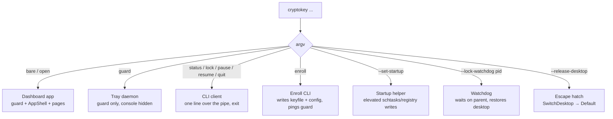
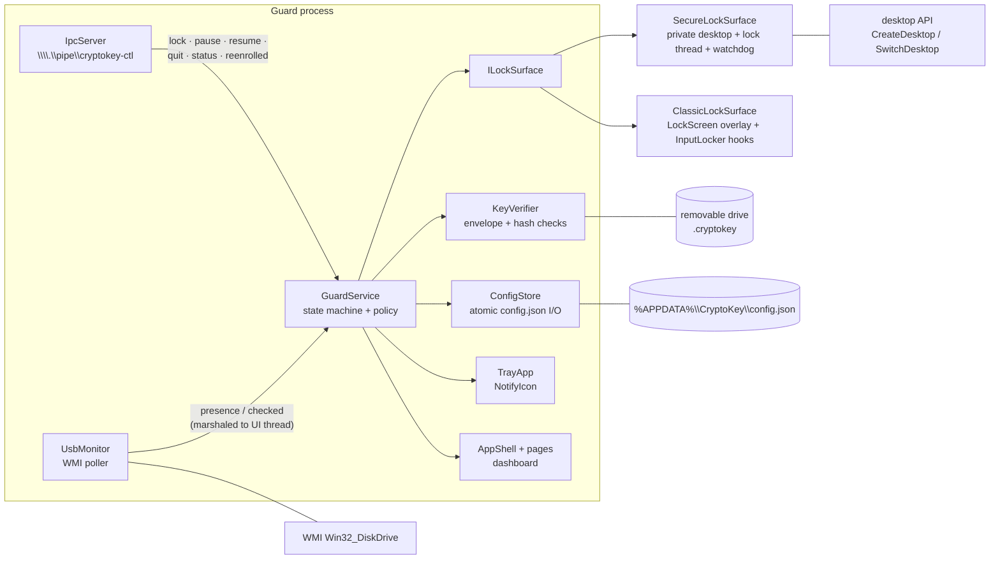

# Architecture

## Process roles — one exe, several hats

`CryptoKey.exe` dispatches on `argv` before anything else happens. All roles
share the same binary and config:

Two important consequences:

- **Single instance.** The guard holds the `Local\CryptoKeyGuard` mutex.
  A second GUI launch doesn't start a second guard — it pipes `open` to the
  running one. `--takeover` waits on the mutex (up to ~30 s) for the
  elevated-restart handoff.
- **No service process.** The daemon is a WinForms app with its console
  hidden; autostart launches `cryptokey.exe guard` via the Run key or a
  scheduled task.

## Component map

`GuardService` is the only stateful coordinator — everything else is a
device it drives. The dashboard, tray, settings pages, and IPC commands all
consume the same `_config` instance and the same event surface
(`StateChanged` snapshots + `LogWritten` activity lines).

## Threading model

| Thread | Owns | Rules |
|---|---|---|
| **UI thread** | `GuardService`, monitor callbacks (marshaled via `BeginInvoke`), config mutation, rotation bookkeeping | Must never block on USB I/O while hooks may be installed — rotation writes go to a worker |
| **WMI worker** (`UsbMonitor`) | `Win32_DiskDrive` enumeration | Polls off-pump so a slow WMI query can't stall hooks; results marshal to the UI thread |
| **Lock thread** (secure mode, per engage) | `SetThreadDesktop` → `InputLocker` LL hooks → `LockForm` → own message pump | STA. Created fresh every engage; teardown closes the form and joins |
| **Rotation worker** | `RotateKeyfiles` — pure file I/O on a pre-built envelope | Reads no mutable config; logs back via `BeginInvoke` |
| **Passphrase worker** | PBKDF2 verify (~100k iterations) | Hook returns instantly; result marshaled back to UI |
| **Watchdog process** | `Process.WaitForExit(parent)` → `SwitchDesktop(Default)` | Separate process, spawned before every secure switch, killed on clean disengage |

The invariant the whole design defends: **the thread that installs the
low-level hooks must pump** — anything that can stall a pump (WMI, USB
writes, PBKDF2) is pushed off it, because a stalled hook callback hits
`LowLevelHooksTimeout` and input leaks through unswallowed.

## Data stores

| Store | Location | Notes |
|---|---|---|
| `config.json` | `%APPDATA%\CryptoKey\` | Atomic tmp+move writes; secret **hashes** only — the raw secret lives only on the drive |
| `guard.log` (+ `.1`) | `%APPDATA%\CryptoKey\` | Append-only activity log, rotated at ~256 KB, fail-safe (can never take the guard down) |
| `.cryptokey` | drive root, hidden+system | `"CKY2" ‖ DPAPI(secret ‖ attestation)` — bound to user+machine; tmp+move writes per letter |
| `cryptokey-ctl` | named pipe | Per-user DACL + medium-integrity SACL (see security-model) |
| `Local\CryptoKeyGuard` | mutex | Single-instance + takeover handoff |
| Registry / Task Scheduler | `HKCU\...\Run\CryptoKey`, task `CryptoKey` | Startup modes — validated by content, not just presence |

## Module inventory (`src/CryptoKey`)

| File | Role |
|---|---|
| `Program.cs` | argv dispatch, mutex/takeover, watchdog + release modes, `status` |
| `GuardService.cs` | State machine, unlock policy, backoff, ratchet orchestration, IPC dispatch, config reload |
| `UsbMonitor.cs` | WMI polling, presence events, error logging |
| `KeyVerifier.cs` | v2 envelope wrap/unwrap, legacy keyfile compat, `RotateKeyfiles` |
| `Config.cs` | `KeyConfig`/`GuardSettings`, hashing, attestation, atomic save, `RotateSecret` |
| `Enrollment.cs` | Drive selection, secret generation, keyfile + config write, `reenrolled` ping |
| `ILockSurface.cs` | Lock abstraction: `Engage`/`Disengage`/`ReleaseInput` + setters |
| `SecureLockSurface.cs` | Private desktop, STA lock thread, watchdog, switch-back discipline |
| `ClassicLockSurface.cs` | `LockScreen` + `InputLocker` adapter — pre-facade behavior |
| `LockScreen.cs` / `Ui/LockForm.cs` | Overlay manager (per-monitor) / the lock card form itself |
| `InputLocker.cs` | `WH_KEYBOARD_LL` + `WH_MOUSE_LL`, passphrase buffer, panic combo, hook-side cooldown |
| `IpcServer.cs` / `IpcClient.cs` | Pipe ACLs + accept loop / one-shot CLI transport |
| `StartupManager.cs` | Run key vs scheduled task, content-validated `GetMode` |
| `TrayApp.cs`, `Ui/` | NotifyIcon, AppShell, dashboard/settings/security/log pages, theming |
