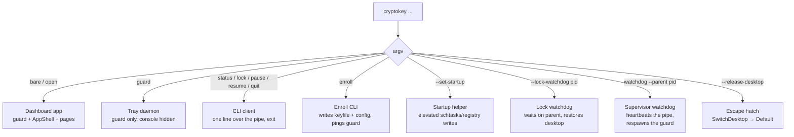
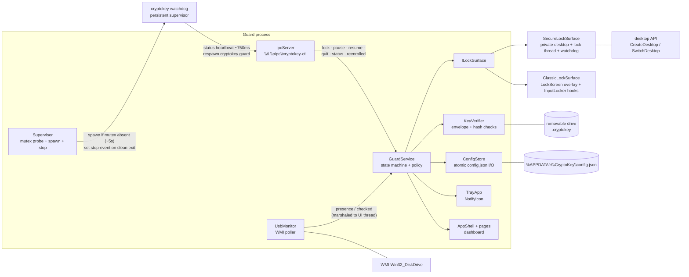

# Architecture

## Process roles — one exe, several hats

`CryptoKey.exe` dispatches on `argv` before anything else happens. All roles
share the same binary and config (the diagram shows the Windows host —
[macos.md](macos.md) has the Mac equivalents):



Two important consequences:

- **Single instance.** The guard holds the `Local\CryptoKeyGuard` mutex.
  A second GUI launch doesn't start a second guard — it pipes `open` to the
  running one. `--takeover` waits on the mutex (up to ~30 s) for the
  elevated-restart handoff.
- **No service process.** The daemon is a WinForms app with its console
  hidden; autostart launches `cryptokey.exe guard` via the Run key or a
  scheduled task.

## Component map



`GuardService` is the only stateful coordinator — everything else is a
device it drives. The dashboard, tray, settings pages, and IPC commands all
consume the same `_config` instance and the same event surface
(`StateChanged` snapshots + `LogWritten` activity lines).

## Threading model

| Thread | Owns | Rules |
|---|---|---|
| **UI thread** | `GuardService`, monitor callbacks (marshaled via `BeginInvoke`), config mutation, rotation bookkeeping | Must never block on USB I/O while hooks may be installed — rotation writes go to a worker |
| **WMI worker** (`UsbMonitor`) | `Win32_DiskDrive` enumeration | Polls off-pump so a slow WMI query can't stall hooks; results marshal to the UI thread |
| **Lock thread** (secure mode, per engage) | `SetThreadDesktop` → `InputLocker` LL hooks → `LockForm` → own message pump | STA. Created fresh every engage; teardown closes the form and joins |
| **Rotation worker** | `RotateKeyfiles` — pure file I/O on a pre-built envelope | Reads no mutable config; logs back via `BeginInvoke` |
| **Phrase worker** | PBKDF2 verify (600k iterations; count stored per-config) | Hook returns instantly; result marshaled back to UI; the char[] attempt is wiped after verify |
| **Lock-watchdog process** | `Process.WaitForExit(parent)` → `SwitchDesktop(Default)` | Per-engage, spawned before every secure switch, killed on clean disengage — covers the kill-both window while locked |
| **Supervisor watchdog process** | Pipe heartbeat (`status`) → release desktop → `LockWorkStation` → respawn `cryptokey guard` | Persistent, one per guard lifetime (`Local\CryptoKeyWatchdog` mutex); stands down on the `CryptoKeyWatchdogStop` event; killed watchdog is respawned by the guard's ~5 s liveness tick |

The invariant the whole design defends: **the thread that installs the
low-level hooks must pump** — anything that can stall a pump (WMI, USB
writes, PBKDF2) is pushed off it, because a stalled hook callback hits
`LowLevelHooksTimeout` and input leaks through unswallowed.

## Data stores

| Store | Location | Notes |
|---|---|---|
| `config.json` (+ `.bak` mirror, `.bad` quarantine) | `%APPDATA%\CryptoKey\` | Flushed tmp→rename writes (`FlushFileBuffers` before the rename); `.bak` mirrors every save — corrupt primary self-heals. Secret **hashes** only — the raw secret lives only on the drive |
| `guard.log` (+ `.1`) | `%APPDATA%\CryptoKey\` | Append-only activity log, rotated at ~256 KB, fail-safe (can never take the guard down) |
| `.cryptokey` | drive root, hidden+system | `"CKY2" ‖ DPAPI(secret ‖ attestation)` — bound to user+machine; flushed tmp→rename writes per letter |
| `cryptokey-ctl` | named pipe | Per-user DACL + medium-integrity SACL (see security-model); doubles as the watchdog's heartbeat |
| `Local\CryptoKeyGuard` | mutex | Single-instance + takeover handoff |
| `Local\CryptoKeyWatchdog` | mutex | One supervisor watchdog per session — spawned only when absent |
| `Local\CryptoKeyWatchdogStop` | named event (manual-reset) | Every graceful guard exit sets it — clean deaths never respawn |
| `watchdog.log` (+ `.1`) | `%APPDATA%\CryptoKey\` | Supervisor's own log — separate file, same 256 KB rotation |
| `lockpolicies.json` | `%APPDATA%\CryptoKey\` | Per-policy priors while locked — kind + raw value verbatim (legacy backups were plain `int?` and still load) — flushed tmp→rename; deleted on restore; a stale file self-heals at next `Start` |
| Registry config backup | `HKCU\Software\CryptoKey\Config` | Third config copy (same JSON, REG_SZ) — survives a folder wipe; Load falls through to it and rewrites the files |
| `captures\*.cap` | `%APPDATA%\CryptoKey\captures\` | Webcam tamper stills (opt-in) — DPAPI-sealed per user+machine, newest 50 kept |
| `vault.ckv` | `%LOCALAPPDATA%\CryptoKey\` (configurable) | CKVAULT1 encrypted volume image — dual header pages (checksummed) + dual manifest slots + AES-GCM chunks; session-scoped Dokan mount only while the key verifies. Manifest seq fences against the attested `VaultEpoch` — an older image gates at `RolledBack` until explicitly ratified |
| Registry / Task Scheduler | `HKCU\...\Run\CryptoKey`, task `CryptoKey` | Startup modes — validated by content, not just presence |

## Vault format — `CKVAULT1`

A single-file encrypted volume we own end-to-end. The image never carries
the device secret — only a random **volume key**, wrapped per key slot.
Everything is AES-256-GCM; every encrypted object authenticates its
location as AAD so ciphertext can't be relocated silently.

```text
header page (4 KiB) ×2 — primary at 0, identical shadow at 4096
  magic "CKVAULT\x01" | version u32 | flags u32 | salt 16B
  keySlot[2]:  { rotationGen u32 | nonce 12B | wrappedVolKey 48B }
  manifestSeq[2] u64 | chunkCount u32 | chunkRegionBase u64
  headerCheck 8B — truncated SHA-256 of the page; a torn-but-plausible
                   primary rejects and the shadow carries the open
manifest slot A + slot B (4 MiB each, fixed)
  magic u32 | seq u64 | plainLen u32 | nonce 12B | tag 16B | ct
chunk region (fills the rest of the image)
  chunk i = nonce 12B | tag 16B | ct 4096B     (4124 B per 4 KiB chunk)
```

- **KEK** = `HMAC-SHA256(deviceSecret, "CryptoKeyVaultKEK" ‖ salt)` —
  derived on demand, never stored, zeroed after use.
- **Key slots** ride the keyfile ratchet: slot A wraps under the current
  generation, slot B under the previous — a stale-but-legit keyfile still
  unseals the vault inside the heal window. Each rotation edge rewraps
  `{cur, prev}`; two rotations without an open seals the image
  permanently (by design — the volume key is nowhere else).
- **Manifest** = JSON tree (paths → metadata + chunk ids + freelist),
  sealed with `(slot, seq)` AAD. Filenames are ciphertext — a stolen
  image reveals nothing. Flush alternates slots and bumps `seq`; a torn
  write falls back to the older decrypting epoch. On open the freelist
  is rebuilt from the node tree — allocated chunks the manifest forgot
  reclaim, garbage free entries clamp, and a doubly-referenced chunk
  fails the open as Corrupt instead of double-freeing.
- **Chunks** are write-through, independently framed; chunk index is AAD.
  Reads on tag failure raise an I/O error (`CrcError` at the Dokan seam),
  never plaintext.
- **Secrets** live in `PinnedBuffer`s (GC can't move them); the service
  copies caller buffers in, zeroes them out, and zeroes everything on
  `KeyGone`/dispose. Derived KEKs are scoped arrays, zeroed after each use.
- **Mount scope**: the Dokan letter is session-scoped (no MountManager
  registration) and the reported ACL names only the owning user — other
  sessions can't see the drive while it's mounted.
- **Unseal/mount are async** — the manifest decrypt (8 MiB) and the driver's
  mount call run on a pool thread with a generation counter dropping stale
  commits, so a key-pull mid-flight can't hold the pump or adopt a dead
  session's mount.
- **Rollback fence**: the manifest `seq` is monotonic; `config.VaultEpoch`
  — inside the keyfile's attestation MAC — is the trusted witness. An
  image that opens older than the attested epoch lands in `RolledBack`:
  unmounted, logged, and gated behind an explicit `vault accept-rollback`
  (the call moves the epoch *down* to the image — never silently). An
  image *ahead* of the epoch adopts forward and flags a re-attest.
- No ADS/hardlinks.

## Module inventory

The tree splits into a platform-neutral core (`src/CryptoKey.Core`,
`net9.0`, no Windows dependencies) and per-platform hosts
(`src/CryptoKey.Win` today). Hosts register a `PlatformServices` bundle via
`Platform.Init` at startup; Core statics resolve OS capabilities through it.

### `src/CryptoKey.Core` — platform-neutral

| File | Role |
|---|---|
| `CryptoKeyCli.cs` | Shared verb table — `enroll`, `status`, `guard`, `open`, `lock`, `pause`, `resume`, `quit`, `watchdog`; hosts keep their OS-specific roles |
| `Platform.cs` / `PlatformInterfaces.cs` / `PlatformImpls.cs` | The seam: `Platform.Services` ambient holder, one interface per OS capability (paths, protector, USB enum, key monitor, IPC ACLs, single-instance, stop-signal, lock policies, capture, system actions, config backup, keyfile attrs, app lifetime, lock surfaces, enroll extras, user alerts), shared null/file impls |
| `GuardService.cs` | State machine, unlock policy, backoff, ratchet orchestration, IPC dispatch, config reload |
| `KeyVerifier.cs` | v2 envelope wrap/unwrap, legacy keyfile compat, `RotateKeyfiles` |
| `Config.cs` | `KeyConfig`/`GuardSettings`, hashing, attestation, save + `.bak` mirror + third-copy fallback, `RotateSecret` |
| `RecoveryPhrase.cs` | Generated 20-char Crockford Base32 credential: `Generate`, `Normalize`, `IsValid` — the only user credential, stored hash-only |
| `AtomicFile.cs` | Durability primitive: tmp → device flush → rename (`FlushFileBuffers` / `F_FULLFSYNC` gated at runtime) — used by config, backup, keyfile, policy writes |
| `Enrollment.cs` | Drive selection, phrase display/confirm, keyfile + config write, `reenrolled` ping |
| `ILockSurface.cs` | Lock abstraction: `Engage`/`Disengage`/`ReleaseInput`, tier marker (`IsOverlay`), `EngageError`, setters |
| `IpcServer.cs` / `IpcClient.cs` | Accept loop + dispatch marshal / one-shot CLI transport |
| `Watchdog.cs` | `Watchdog.Run` — heartbeat/respawn/OS-lock role + `Supervisor` — guard-side liveness probe, spawn, stop |
| `UsbDisk.cs` | One USB device: serial, model, mounted volume paths |
| `GuardState.cs` | `GuardState` + `StatusSnapshot` |
| `FlapPolicy.cs` | Desktop-flap classification + sliding-window storm counter — pure logic, unit-tested |
| `AlertService.cs` | Security-event push: POST + `Title` header to a user URL (ntfy.sh/webhook), 4 s, quiet after first failure |
| `Backoff.cs` | Phrase-freeze ladder (15s doubling → 300s cap) — extracted for the test suite |
| `Vault/VaultFormat.cs` | CKVAULT1 codecs — header page, KEK derivation, key-slot wrap/unwrap, chunk + manifest AES-GCM framing |
| `Vault/VaultVolume.cs` | The sealed device: image create/open, case-insensitive dir tree, freelist allocator, chunked R/W, dual-slot manifest with torn-write fallback, `PinnedBuffer` key hygiene |
| `Vault/VaultService.cs` | Lifecycle owner — consumes verified secrets from the guard, unseals/mounts on verify, force-dismounts on `KeyGone`, slides key slots on rotation |

### `src/CryptoKey.Win` — Windows host (`cryptokey.exe`)

| File | Role |
|---|---|
| `WinPlatform.cs` | The `PlatformServices` bundle: `%APPDATA%` paths, DPAPI protector, WMI enumerator, mutex/event primitives, pipe SDDL, HKCU third copy, `LockWorkStation`, surface factory, MessageBox alerts |
| `Program.cs` | `Platform.Init` + argv dispatch — Windows-only roles (`install`, `--set-startup`, `--release-desktop`, `--lock-watchdog`, `--export-icon`), GUI/tray pump |
| `UsbMonitor.cs` | `IKeyMonitor` — hidden message window, `WM_DEVICECHANGE` + 1s poll fallback, error tolerance |
| `SecureLockSurface.cs` | Private desktop, STA lock thread, watchdog, switch-back discipline |
| `ClassicLockSurface.cs` | `LockScreen` + `InputLocker` adapter — pre-facade behavior |
| `LockScreen.cs` / `Ui/LockForm.cs` | Overlay manager (per-monitor) / the lock card form itself |
| `InputLocker.cs` | `WH_KEYBOARD_LL` + `WH_MOUSE_LL`, phrase buffer (char[], wiped), panic combo, hook-side cooldown |
| `NativeMethods.cs` | Win32 P/Invoke surface |
| `LockPolicies.cs` | While locked: HKCU `DisableTaskMgr`/`NoLogoff`/`NoClose` = 1 with exact prior-value backup/restore |
| `CaptureService.cs` | FlashCap one-shot webcam stills on tamper — fire-and-forget, single-flight, log-once failure; written DPAPI-sealed (`.cap`) |
| `Sounds.cs` | Synthesized PCM cues (lock thunk, unlock chime, storm blip) — generated WAVs, `SoundPlayer.Play` off-thread |
| `StartupManager.cs` | Run key vs scheduled task, content-validated `GetMode` |
| `ShortcutManager.cs` | `.lnk` writer (WScript.Shell) — Start Menu + Desktop targets, auto-created on enroll |
| `TrayIcons.cs` | Runtime badge renderer; `BuildIcoBytes` also produces the committed `app.ico` |
| `Vault/DokanVaultFileSystem.cs` | `IDokanOperations` adapter — translates driver callbacks to `VaultVolume`, maps results to `NtStatus` (tamper → `CrcError`) |
| `Vault/DokanMount.cs` | `IVaultMounter`/`IVaultMount` over DokanNet — mount thread, driver-presence probe, drive-letter selection, force-dismount |
| `TrayApp.cs`, `Ui/` | NotifyIcon, AppShell, dashboard/settings/security/vault/log pages, theming |

### `src/CryptoKey.Mac` — macOS host (`cryptokey`, Avalonia 11)

| File | Role |
|---|---|
| `MacPlatform.cs` | The `PlatformServices` bundle: `~/Library/Application Support` paths, Keychain protector, DA enumerator, poll `MacKeyMonitor`, unix-socket IPC, `flock` single-instance + stand-down file, `FileConfigBackup`, `CGSession`/`pmset`/`osascript` actions, pump or Avalonia dispatcher, surface factory |
| `MacInterop.cs` | P/Invoke surface — CoreFoundation, CoreGraphics, Security, DiskArbitration, libc (`statfs`, `flock`), libobjc (`setLevel:`, activation policy) |
| `MacUsbEnumerator.cs` | `/Volumes` → `statfs` → `DADiskCreateFromBSDName` — removable + serial per mount, grouped per whole disk |
| `KeychainProtector.cs` | AES-GCM wrap key in the login Keychain (device-only accessible); entropy → AAD |
| `MacLockSurface.cs` | `CGEventTap` on its own run-loop thread + `CGDisplayCapture` + fixed char buffer; engage fails closed via `CGSession -suspend` |
| `Ui/` | `MacApp` + `AvaloniaUiDispatcher`, `LockWindowCtl`/`LockWindow` (per-screen shielding cards), `MacTray` (menu-bar verbs → `DispatchCommand`) |
| `MacInstall.cs` | `install`/`uninstall` — payload copy to `~/Applications/CryptoKey`, LaunchAgent plist + `launchctl bootstrap` |
| `Program.cs` | `Platform.Init` + argv dispatch — UI tier by default, `--headless` pump fallback, hidden `uitest` smoke |

`tests/CryptoKey.Tests` (xUnit, `net9.0`) covers the pure security
invariants — rotation chain (incl. `keepPrev` orphan-proofing),
envelope/attestation, tri-state match, `RotateKeyfiles` semantics, backoff
ladder, config-store round-trip, and the vault suite (header/kekslot
round-trips, two-generation seal window, chunk tamper → integrity error,
torn-manifest fallback, tree/alloc/capacity semantics, filename
confidentiality). The store is redirected into a temp dir
by `CRYPTOKEY_CONFIG_ROOT` and `Platform.Services` gets a null/temp
bundle — both set in a module initializer before any test code runs, so
the ambient can't be captured too early. The interactive layer
(`SecureLockSurface`/`SwitchDesktop`, pipe ACLs, WMI) stays manual — CI
agents are non-interactive.
