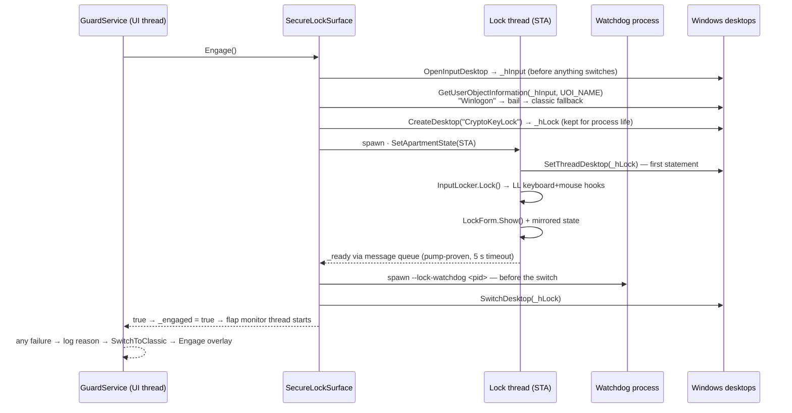
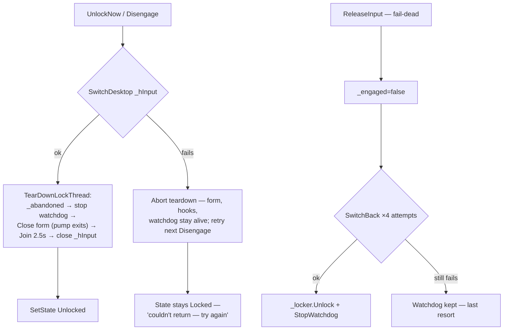
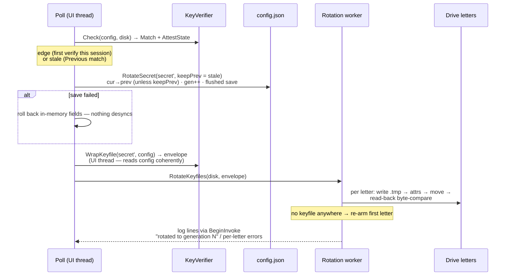
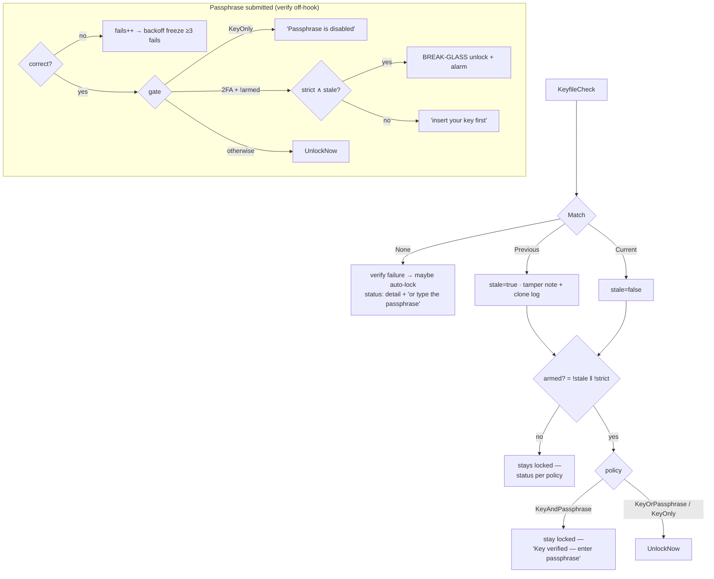

# Lifecycle

## Guard state machine

```mermaid
stateDiagram-v2
    [*] --> Unlocked
    Unlocked --> Locked : key removed / verify fail<br/>[LockOnRemoval] · IPC lock
    Unlocked --> Paused : IPC pause N / tray
    Paused --> Unlocked : IPC resume · timer expires
    Paused --> Locked : timer expires + key absent
    Locked --> Unlocked : verified key [policy] · passphrase [policy] · break-glass
    Locked --> Locked : stale keyfile → rotate &amp; re-verify<br/>cooldown · wrong passphrase
```

`State` is the single source of truth — tray, dashboard, IPC `status`,
`quit` gating, and `DispatchCommand` all read the same snapshot
(`StatusSnapshot`: state, key presence/model, verify failure, pause expiry,
tamper note, key-factor armed).

`LockOnRemoval` arming rule: auto-lock only fires when the guard has seen
the enrolled device since startup — a machine booted without the key
doesn't instantly lock itself while WMI enumerates.

Idle lock (`Guard.IdleLockMinutes`, default 0 = off): the ~5 s slow tick
(the watchdog timer) reads `GetLastInputInfo`; when idle exceeds the
threshold it locks on the UI thread with reason `idle N min`. Fires only
from `Unlocked` — `Paused` suppresses it like all auto-lock.

Lock-time policies (`Guard.LockPolicies`, default on): `LockNow` applies
HKCU `DisableTaskMgr`/`NoLogoff`/`NoClose` right after `SetState(Locked)`
— even if both surfaces fail — persisting priors to `lockpolicies.json`
first (existing backup = priors already captured, never re-read).
Restore fires on every exit from the locked state: `UnlockNow` after a
successful `Disengage`, `ReleaseInput` (fail-dead), `Dispose`, and a
`Restore` pass at `Start` for the died-while-locked respawn —
`LockWorkStation` is the real boundary there, so clearing is correct
even mid-OS-lock. Restore is read-gated: a value that isn't present is
skipped before any writable handle is opened, so read-only Policies
keys (hardened images) get a clean no-op rather than a kept backup.

## Secure-desktop engage sequence



Ordering invariants:

- `_hInput` is captured **before** `CreateDesktop` and **reused** across
  retries — it's the verified way home.
- The watchdog exists **before** `SwitchDesktop` — a crash during the
  switch is exactly what it covers.
- `_engaged` is only set after `SwitchDesktop` succeeds — it's the
  authoritative flag; the form's lifetime races Joins.

## Desktop-flap monitor

While `_engaged`, a background thread (`CryptoKey.Flap`, ~300ms) polls
`OpenInputDesktop` — the same `SwitchDesktop` `--release-desktop` uses is
available to any same-session process, so an attacker could steal input
from the lock desktop without killing anything or touching a hook. The
tick takes `_engageSync`, so `Disengage`'s switch-back is never misread.

| Input desktop | Class | Action |
|---|---|---|
| `CryptoKeyLock` | healthy | none |
| `Winlogon` by name, or open fails (SAS ACL-deny tell) | legit — CAD/UAC | skip, not counted; input returns on its own |
| anything else — `Default`, attacker desktops | hostile flap | `SwitchDesktop(_hLock)` + `SecurityEvent("desktop-flap")`; ≥3 in 10s → `"desktop-flap-storm"` + `LockWorkStation` |

The storm drops the attacker at real Windows auth — their script can't
answer OS credentials. The monitor dies when `_engaged` clears; the
counter resets on teardown.

## Disengage / release paths



Three distinct paths, deliberately different:

- **`Disengage`** — the normal unlock: switch first, tear down second,
  refuse to tear down if the switch fails (returns `false`).
- **`ReleaseInput`** — fail-dead from the pump-died `finally` or the
  guard's fatal path: clears `_engaged`, retries the switch, unhooks,
  reaps the watchdog.
- **Watchdog / `--release-desktop`** — external recovery: the process died
  or wedged; pull input back to `Default` from outside.

Panic combo (`Ctrl+Alt+Shift+F12`, dev builds): `Disengage()` **then**
`Application.Exit()` — exiting while switched leaves the user on an empty
desktop, so the order matters. It's checked in the hook *before* the
cooldown gate, so it works during a passphrase freeze.

## Mutual supervision

```mermaid
sequenceDiagram
    participant GS as GuardService
    participant SUP as Supervisor (guard-side)
    participant WD as Watchdog process
    participant IPC as cryptokey-ctl pipe

    GS->>SUP: WatchdogTick() — at Start, then every 5 s
    alt Guard.Watchdog on
        SUP->>WD: mutex absent → spawn `watchdog --parent <pid>`
    else toggled off
        SUP->>WD: set CryptoKeyWatchdogStop → watchdog exits, stays down
    end
    loop every ~750 ms (3 misses ≈ 2 s dead)
        WD->>IPC: status (500 ms timeout)
        IPC-->>WD: ok state=… watchdog=… — last-seen locked flag
    end
    alt guard died while locked — fail closed
        WD->>WD: SwitchDesktop(Default) → LockWorkStation → respawn guard
    else guard died unlocked
        WD->>WD: respawn guard (2 s backoff; 5 fails → LockWorkStation, then 30 s retry)
    end
    Note over GS,SUP: graceful exit (quit / panic / dispose / takeover)<br/>→ set stop event BEFORE dying → no respawn
```

`watchdog` exits immediately with no `config.json` — nothing to respawn
into. It's deliberately dumb: no UI, no config parse, any pipe that
answers is "the guard" — an orphaned watchdog adopts a restarted guard
without a handshake.

## Secret ratchet sequence



Throttled to one attempt per 5 s — a drive that can't be written stays
`prev`-verifiable and retries forever instead of churning or locking out.

## Unlock decision flow



## Backoff ladder

```text
failed attempts  1   2   3    4    5    6    7    8+
freeze           —   —   15s  30s  60s  120s 240s 300s (cap)
```

Enforced inside `WH_KEYBOARD_LL` — the hook returns 1 before buffering,
so input during a freeze is eaten, not counted. The panic combo is checked
before the gate. `LockScreen`/`LockForm` paints the amber countdown from
`_cooldownUntil`; the counter is in-memory and dies with the lock session.

## Pause semantics

`pause [mins]` (default 5) is valid from `Unlocked` **or** `Paused` —
re-pausing extends the timer. Expiry is checked on every poll
(`CheckPauseExpiry`): returns to `Unlocked`, then if the key is still
absent, `MaybeAutoLock` fires immediately — a pause ending with the drive
out locks on the spot rather than at the next removal.
