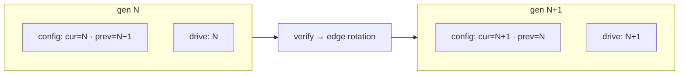

# Security model

## Threat model

CryptoKey is a **convenience lock**, not a security boundary. It defends
against the honest-attacker scenarios — someone walking up to an unlocked
desk, a borrowed laptop, "who touched my machine" — with durable tripwires
for the rest.

| Defends against | Mechanism |
|---|---|
| Opportunistic access when you step away | Lock on removal (or failure to verify) + input containment |
| Focus-stealing / covering the lock UI | Secure mode: private desktop — nothing else exists there |
| Keyfile copied to another drive or another user | Hardware serial check + DPAPI binding (user+machine) |
| Long-lived key cloning | Secret ratchet — a stale clone is flagged and burns out |
| `config.json` tampering | Keyfile attestation MAC over the security-relevant Guard fields — announce-then-heal tripwire |
| Recovery-phrase brute force | PBKDF2 + exponential input freeze enforced in the hook |
| Single-process kill of the guard | Persistent watchdog — heartbeats the control pipe (~2 s dead-detection), fail-closed `LockWorkStation` + respawn if the guard died locked, respawn if unlocked. The guard respawns the watchdog the same way |
| Casual discovery of the kill path | Lock policies — while locked, HKCU `DisableTaskMgr`/`NoLogoff`/`NoClose` hide Task Manager, Sign out/Switch user, and Start-menu power buttons. In overlay mode this closes the CAD → Task Manager → end-process kill path outright; in secure mode it's a garnish on top of desktop isolation. Priors (any registry kind) backed up verbatim to `lockpolicies.json`, restored on unlock |
| "Walked away with the key still in" | `GetLastInputInfo` idle lock — fires only from Unlocked (Paused suppresses it like all auto-lock) |
| Wiping the whole `%APPDATA%\CryptoKey` folder | Registry backup — `HKCU\Software\CryptoKey\Config` holds the same JSON, a third copy on a different kill surface. Load chain: primary → `.bak` → registry (registry restores re-create both files and log as tamper); the watchdog's respawn gate accepts any copy |
| Silent tamper | Webcam stills (opt-in, `captures/` trimmed to 50) + remote alerts via ntfy.sh/any webhook — tripwires become forensics and a pager. Captures are DPAPI-sealed (`.cap`) — only this user on this machine can view them |
| Vault left mounted on an unattended unlocked session | `VaultIdleMinutes` idle seal — past the threshold a mounted vault gets the full `KeyGone` teardown (dismount + zeroed keys), and the verify feed stays suppressed until input returns, so the vault remounts when you do |
| `SwitchDesktop`-away attack | Flap monitor — while the secure desktop is engaged it polls `OpenInputDesktop` every ~300ms inside `_engageSync`; a foreign input desktop gets re-switched instantly, ≥3 in 10s escalates to `LockWorkStation` + alert + snap (the attacker lands on real OS auth). Legit paths — `Winlogon` by name, or an `OpenInputDesktop` failure (the SAS ACL-deny tell) — are skipped, not counted |
| Stolen machine / copied `vault.ckv` | The vault image holds only an AES-GCM-wrapped volume key — the KEK derives from the **device secret**, which lives nowhere but the USB key. No key, no mount; filenames are ciphertext too |
| Copied `vault.ckv` + cloned keyfile on another machine (bound vault) | `vault tpm-bind` folds a 32B pepper into the KEK, wrapped by a persisted **TPM** key (`Microsoft Platform Crypto Provider`, user-scoped RSA-2048). The image reports `TpmLocked` anywhere the pepper won't unwrap — the phrase blob (`recPepperBlob`, phrase-KDF'd AES-GCM) is the portable hatch unless bound `--strict`. **Honest bounds:** user-scoped CNG means same-user live malware can `NCryptDecrypt` while the TPM is healthy — this stops *copied artifacts*, not *resident code*; the TPM adds no PIN/ACL gate (CNG's contract); PCR binding isn't implemented (future TBS work); and `--strict` + a TPM clear means the image is unrecoverable — reformat |
| Vault visible to another logged-in user | The Dokan mount is session-scoped (no MountManager registration) and the reported ACL names only the owning SID — other sessions can't see the letter |
| Swapped-in older `vault.ckv` (rollback) | The manifest `seq` is monotonic; `VaultEpoch` — inside the keyfile's attestation MAC — remembers the highest seq attested. An older image never mounts: it gates at `RolledBack` until an explicit `accept-rollback` ratifies it. **Honest bound:** the fence can't tell "attacker restored an old copy" from "your backup is legitimately behind" — it stops the world and asks; the judgment call stays the user's |
| Forged/tampered update payloads | The update channel is the one component that can replace the guard wholesale — so nothing applies unless the manifest's ECDSA-P256 signature verifies against the maintainer key **pinned in the binary**. HTTPS and GitHub's account are transport only; a compromised repo can't forge a manifest. Tag-binding (`# release:`) stops an older signed payload being re-served as newer, the zip's sha256 is pinned by the manifest, extraction rejects path traversal, and downloads are `.part`-atomic. **Honest bounds:** a *signed-but-malicious* release is trusted by definition (the maintainer key IS the root — it lives in a CI secret/offline PEM, never the repo); and updates are notify-only — no silent apply, refused while locked — so a pushed release never lands unobserved |

| Does **not** defend against | Why |
|---|---|
| `taskkill`/`Stop-Process`/Process Explorer | Lock policies hide the Task Manager GUI affordance only — the kill capability itself is untouched |
| CAD "Switch user" | `HideFastUserSwitching` is an HKLM-only policy — outside user-mode scope. The session stays locked in the background and another user can't reach our processes anyway |
| Ctrl+Alt+Del power button | No user-mode policy can remove it — `NoClose` covers Start only |
| Hardened images that deny user writes to `HKCU\...\Policies` | Policies apply partially or not at all (logged `N/3`) — run the guard elevated for full coverage |
| GPO-owned policy values | A domain refresh owns these keys — ours flicker off until the next lock; cosmetic failure for a cosmetic feature |
| Name-based mass kill (`taskkill /f /im cryptokey.exe`) | Both processes die in one call — the user-mode ceiling. The per-engage lock-watchdog still restores your desktop on a locked kill |
| Wiping `config.json` + `.bak` + the registry backup + killing the pair | Nothing to respawn into — three copies live on three surfaces now, but an attacker who knows all three still wins |
| A same-user attacker who knows the registry key | `HKCU\Software\CryptoKey\Config` is readable/writable by the user — the backup is honest about that; it only ever feeds a Load that the keyfile's attestation then verifies |
| Sub-tick desktop access | Each flap grants ~300ms of flicker, never usable access — the re-switch always wins, and a storm drops the attacker at OS auth. One accepted race: a storm colliding with a legit unlock can escalate to `LockWorkStation` post-unlock — fail-safe direction, vanishingly rare |
| Ctrl+Alt+Del / On-Screen Keyboard | SAS and UIAccess can't be hooked from user mode (OSK bypasses the keyboard hook entirely) |
| Firmware-level serial spoofing | WMI serials are what the drive reports; cheap drives report junk |
| An attacker who can enroll their own drive | Enrolling requires interactive access to the app — an unlocked session is already lost |
| Vault recovery via passphrase alone | Deliberate: the vault has **no** passphrase factor — only the physical key unseals it. A stolen `vault.ckv` is inert |
| Vault surviving two rotations unopened | Dead by design — the heal window is exactly one generation. An image not unsealed before slot B's generation retires is permanently sealed; reformat is the only path |

## Key material

| Item | Where | Form |
|---|---|---|
| Device secret | `.cryptokey` on the drive | 64 random bytes, generated at enroll; never stored locally in plaintext |
| `SecretSalt` / `SecretHash` | `config.json` | Verifier: `SHA-256(salt ‖ secret)` — 64 B of entropy, single salted SHA-256 suffices |
| `PrevSecretHash` | `config.json` | Prior generation — the interrupted-rotation heal window |
| `PassphraseHash` | `config.json` | PBKDF2-HMAC-SHA256 over the normalized recovery phrase, per-config iteration count (600 000 new, legacy 100 000 verifies), salted — the failsafe factor |
| Vault volume key | `vault.ckv` key slots | 256 random bits, AES-256-GCM-wrapped twice — once under the current-generation KEK, once under previous. Never stored or logged unwrapped |
| Vault KEK | derived, in-memory only | `HMAC-SHA256(deviceSecret, "CryptoKeyVaultKEK" ‖ headerSalt ‖ pepper)` — the pepper input is empty on unbound images. Lives in a pinned buffer, zeroed on dismount/dispose |
| Vault pepper | TPM key `CryptoKeyVault` (Platform Crypto Provider, user-scoped) + header `recPepperBlob` | 256 random bits generated at `vault tpm-bind`; wrapped RSA-2048-OAEP-SHA256 by the TPM, and — unless `--strict` — AES-GCM-sealed under `PBKDF2(normalized phrase, "CKV-REC"‖headerSalt, recIters)`. Held in a pinned buffer only while the vault is open; zeroed on KeyGone/dispose/unbind |
| Attestation | inside the keyfile envelope | `HMAC-SHA256(secret, "CKY-ATTEST2" ‖ serial ‖ PassphraseHash ‖ guard-canon)` — legacy `CKY-ATTEST` MACs still verify |

## Recovery phrase

The failsafe credential is **generated, never chosen**: 20 Crockford
Base32 characters (`0123456789ABCDEFGHJKMNPQRSTVWXYZ` — no I, L, O, or U,
dropping the 0/1 lookalikes) ≈ 100 bits, shown grouped as
`XXXXX-XXXXX-XXXXX-XXXXX`, once, at enrollment and each regeneration;
only the PBKDF2 hash is stored. Entry is normalized — uppercased,
separators dropped, `O→0` and `I`·`L→1` folded — so transcription slips
still verify, while `phrase + stray char` does not.

It replaces the old user-chosen passphrase. The migration is deliberately
one-way: every credential is normalized before hashing, so a raw legacy
passphrase hash can never match — old passphrases stop working. The
escape hatch is the Security tab's regenerate flow, which authorizes by
**current phrase OR a freshly verified enrolled key** — and the key is a
stronger proof than the credential anyway.

## Keyfile envelope (v2)

```text
.cryptokey on disk:

  "CKY2" (4B magic) ‖ ProtectedData.Protect( plaintext , CurrentUser )

  plaintext = secret (64B) ‖ attestation (32B)
```

- **DPAPI under `CurrentUser`** binds the file to this Windows user on this
  machine — a copied `.cryptokey` unwraps to garbage anywhere else.
- **Attestation MAC** covers the serial, the phrase hash, and a
  deterministic canon of the security-relevant Guard fields (`UnlockPolicy`,
  `StrictTamper`, `LockMode`, `LockOnRemoval`, `Watchdog`, `LockPolicies`,
  `IdleLockMinutes`, `WebcamOnTamper`, `AlertUrl`, `VaultEnabled`,
  `VaultAutoMount`, `VaultIdleMinutes`, `PollIntervalMs`) plus `VaultEpoch`
  — the vault image's manifest-seq witness (see the rollback fence below)
  — an off-app edit
  that silently downgrades security trips the wire. Cosmetic/layout fields
  (Sounds, BalloonTips, Animations, mount letter, image path, size) are
  deliberately outside it. Semantics are **announce, then ratify**: a
  mismatch flags tamper + log + snap + alert once, then the envelope
  re-wraps to the live config (same secret — no generation burn). In-app
  saves mark the flag instead (`MarkConfigDirty`), so our own edits heal
  silently. It's a tripwire, not a gate — a same-user attacker who also
  dismisses the flag still wins; the defense is the noise it makes.
- **Legacy 64-byte files** (pre-v2 raw secret) verify as `AttestState.Missing`
  — "pre-attestation" — and self-upgrade on the next rotation. They log
  once; they don't raise the clone alarm. Reads accept three attestation
  forms fixed-time — epoch canon, pre-epoch canon, legacy serial+phrase —
  while writes always emit the newest form.
- Envelope parsing is strict: bad magic, DPAPI unwrap failure, short
  plaintext, or a fixed-time attestation mismatch all classify cleanly —
  unwrap failures are treated as "not ours" and fail closed.

## Secret ratchet

Every verified key session burns the secret. Config moves first — atomic
`config.json` save — then every mounted letter's keyfile is rewritten
(tmp+move+read-back). The drive can lag one generation safely: a `Previous`
match still verifies but is flagged.



Failure semantics:

- **Crash after config save, before write** → drive holds `prev` → stale
  verify → heals on next pass (`keepPrev` pins the chain so a failed write
  can never orphan the drive two generations back).
- **Keyfile deleted from every letter** → nothing verifies, so no rotation
  edge ever fires — the drive stays dead until the explicit **Repair
  keyfile** action (Security tab; unlocked + drive present). Auto-heal is
  deliberately avoided: writing a fresh keyfile on a failed check would
  arm any drive spoofing the serial.
- **Previous-generation match** → unlocks (non-strict) but logs
  "possible clone", sets the tamper badge, and re-poisons itself.
- Clone lifetime is bounded: every guard restart burns a generation.

The **vault inherits the ratchet**: its two key slots track the secret
window — slot A wraps under the current generation, slot B under previous.
Every rotation edge the vault service witnesses rewrites both slots
(`{cur, prev}` slides forward), so a copied `.cryptokey` opens the vault
only inside the same one-generation window it can unlock the PC in. A
cloned drive stopped being useful the moment the real key rotated twice;
so does a vault it could once unseal. The service also retains the
displaced generation in memory for one feed as an open-fallback, so an
image sealed through a rotation still unseals and re-wraps forward. The
other edge of the knife: an image that misses the feed window entirely —
two consecutive rotations, or a rotation while no verified session holds
either secret — is sealed **permanently** — the volume key exists nowhere
else, by design.

Independently of the key window, `VaultEpoch` rides inside the attestation
canon as the vault's monotonic witness: the service checkpoints the
manifest seq at every open/close/reformat boundary, so an image swapped
for an older copy fails the fence rather than silently serving stale
files — and editing the epoch by hand trips attestation itself.

## Unlock policies

`Guard.UnlockPolicy` — `KeyOrPassphrase` (default), `KeyAndPassphrase`,
`KeyOnly` — plus `StrictTamper`:

| Policy | Key insert | Recovery phrase | Stale keyfile |
|---|---|---|---|
| `KeyOrPassphrase` | unlocks | unlocks | unlocks (flagged) — strict: no |
| `KeyAndPassphrase` | **arms the factor** — stays locked until the phrase | completes unlock only while armed | strict: doesn't arm |
| `KeyOnly` | unlocks | rejected — "insert the key" | strict: no auto-unlock |

- Under `KeyAndPassphrase` the armed factor is **volatile**: removing the
  key while locked disarms it — a correct phrase alone won't unlock
  ("insert your key first").
- **Break-glass**: strict + stale keyfile + correct phrase → unlocks,
  logged loudly as a break-glass event with the tamper alarm. An absent key
  under 2FA is *not* break-glass — the phrase alone never suffices.
- `StrictTamper` says a replayed previous-generation secret never counts as
  the key factor — under any policy. The rotation still heals the file to
  current, at which point normal rules apply.

## Lock surfaces

| | `secure` (default) | `overlay` (`--classic`, or `LockMode:"overlay"`) |
|---|---|---|
| Mechanism | Private desktop `CryptoKeyLock` + `SwitchDesktop` | Per-monitor borderless topmost forms + `ClipCursor` |
| What attacker sees | Empty desktop + the lock card — no taskbar, no windows | Your wallpaper behind a dark overlay |
| Input containment | Structural + LL hooks on the lock thread | LL hooks swallow everything |
| Reachable by Task Manager UI | No (lock UI lives on another desktop) | Yes (it's a window) |
| Failure rescue | Lock-watchdog + supervisor + `--release-desktop` + panic | Supervisor only — no desktop to rescue |
| Cost | Lock thread + watchdog process per engage | One-shot hooks + forms |

Engage failures in secure mode **auto-fall-back to the overlay** — the lock
must always land. The overlay is also the SAS-safe path: locking while the
Ctrl+Alt+Del screen is up deliberately skips the desktop switch.

## IPC & pipe security

`\\.\pipe\cryptokey-ctl` accepts one line per connection from the local
machine:

- **DACL**: `GA` to the owning user's SID only — another user's session
  can't `pause`/`lock`/`quit` you.
- **SACL**: medium-integrity label so a normal medium-IL CLI can command an
  elevated guard, while low-IL (sandboxed) processes stay out. Applied only
  when `SE_SECURITY_PRIVILEGE` is available; startup logs which branch
  landed.
- Per-connection read timeout (~5 s) — a connect-but-silent client can't
  starve the pipe.
- `quit` is refused while locked (quitting would be a silent unlock);
  `pause` requires unlocked/paused.

## Recovery-phrase backoff

Failures 1–2 are free. From failure 3: `15 << min(fails−3, 5)` seconds,
capped at 300 — 15 s → 30 s → 60 s → 120 s → 240 s → 300 s. Enforced
**inside the low-level hook** before any buffering or Enter handling, so
input during a freeze is eaten without counting. The lock screen paints a
live countdown. The counter is in-memory — it clears on unlock, re-lock,
config reload, or restart (documented trade-off).

## macOS equivalences (`CryptoKey.Mac`)

The crypto and state machine are identical; the OS-facing primitives differ:

- **Keyfile binding**: DPAPI's machine+user seal becomes a random AES-256-GCM
  wrap key in the login Keychain (`kSecAttrAccessibleWhenUnlockedThisDeviceOnly`
  — never iCloud, unusable while locked). The caller-supplied `entropy` rides
  as AES-GCM *additional authenticated data*, so a ciphertext can only be
  unwrapped under the same call context. A copied keyfile is as dead off this
  Mac as a DPAPI blob is off the Windows box.
- **IPC**: `cryptokey-ctl` is a unix socket under the per-user `$TMPDIR` —
  same-user-only by filesystem layout; the DACL/SACL hardening has no analog
  needed (no cross-integrity sharing to label for).
- **Single-instance / supervision**: `flock` on config-dir lockfiles (dies
  with the process, same semantics as the mutexes). The watchdog pair is
  unchanged; launchd (`KeepAlive=Crashed`) adds a third, outermost respawn
  layer — it revives signal-killed guards but lets clean exits stay dead.
- **Lock surface**: there is no private-desktop API on macOS. The single tier
  is `CGDisplayCapture` (blanks every display to the capturing app) +
  shielding-level windows + a session `CGEventTap` that eats all HID events
  and feeds the same fixed 256-char buffer. Death safety is stronger than
  Windows by construction — capture and taps are per-process resources, so a
  killed guard always releases the session; no lock-watchdog needed.
- **Fail-closed**: a failed engage (missing Accessibility permission)
  releases everything and calls `CGSession -suspend` — the real OS lock
  stands in for Task-Manager sealing.
- **Tripwires**: idle meter via `CGEventSourceSecondsSinceLastEventType`;
  lock policies and webcam capture are no-ops (no platform equivalent
  wired yet).

## Known limits

Carried from the [root README](../README.md#warnings--known-limits):
self-lockout is real (test in `--dev`); Ctrl+Alt+Del/OSK can't be blocked
from user mode; serials can be spoofed at firmware level; DPAPI makes the
keyfile single-user/single-machine (one enrolled user per drive); a running
guard rewrites `config.json` on every rotation (`cryptokey quit` before
hand-editing).
